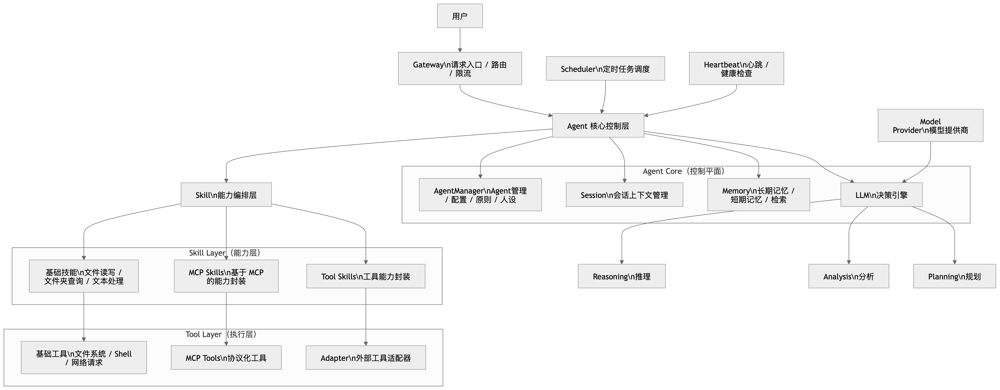

# MiniOpenCode

> 梦想始于平凡，有些疯狂，曾被嘲笑。但只要开始，终将抵达非凡。

AI Agent 服务，支持多轮对话和工具调用的流式对话。

## 架构图



```
User → API → Agent → Process → LLM
                    ↓
                  Tools
```

## 项目结构

```
miniopencode/
├── src/
│   ├── index.ts              # 服务启动入口
│   ├── app.ts                # Express 应用入口
│   ├── agent/
│   │   ├── index.ts         # Agent 核心控制层
│   │   ├── api.ts           # API 路由
│   │   ├── cli.ts           # CLI 模块
│   │   ├── llm.ts           # LLM 对话封装
│   │   ├── process.ts       # React loop 执行
│   │   ├── session.ts       # 会话管理
│   │   ├── types.ts        # 类型定义
│   │   └── ws.ts           # WebSocket 模块
│   ├── middleware/
│   │   └── auth.ts          # API 认证中间件
│   ├── models/
│   │   └── textRecord.ts    # 数据记录模型
│   └── services/
│       ├── storageFactory.ts  # 存储抽象工厂
│       └── toolService.ts    # 工具服务
├── src/ui/                   # 桌面 UI 模块 (Electron)
│   ├── main.ts              # Electron 主进程
│   ├── preload.ts           # 预加载脚本
│   ├── renderer/            # 渲染进程
│   └── package.json
├── examples/                 # 使用示例
├── docs/                     # 文档
├── postman_collection.json   # Postman 测试集合
├── tsconfig.json             # TypeScript 配置
├── package.json
└── README.md
```

## 源码解析

https://www.opencodeshare.cn/docs/minicode/minicode-11-agent-react

## 技术栈

- **运行时**: Node.js 22+
- **框架**: Express.js
- **语言**: TypeScript
- **AI SDK**: Vercel AI SDK (`ai`) + Anthropic SDK
- **认证**: API Key (`X-API-Key` header)

## 运行与安装

```bash
# 安装依赖
npm install

# 复制环境变量配置
cp .env.example .env
# 编辑 .env 填入配置

# 启动服务
npm start

# 开发模式（热重载）
npm run dev
```

服务启动后访问 `http://localhost:3000`

## 配置说明

启动脚本需在 `.env` 文件中配置以下环境变量：

| 变量名 | 必填 | 说明 |
|--------|------|------|
| `API_KEY` | 是 | API 认证密钥，用于 `X-API-Key` 请求头验证 |
| `MINIMAX_CN_API_KEY` | 是 | MiniMax AI 接口密钥，用于调用 AI 模型 |
| `STORAGE_TYPE` | 否 | 存储类型，默认 `file` |
| `PORT` | 否 | 服务端口，默认 `3000` |

**示例 `.env` 文件：**

```env
API_KEY=your_fixed_api_key_here
MINIMAX_CN_API_KEY=your_minimax_api_key_here
STORAGE_TYPE=file
PORT=3000
```

## 桌面 UI

项目提供 Electron 桌面应用，支持 macOS 和 Windows。

### 安装与运行

```bash
# 1. 启动后端服务（在项目根目录）
npm run dev

# 2. 安装 UI 依赖（在新终端）
cd src/ui
# 中国区用户建议使用镜像
ELECTRON_MIRROR=https://npmmirror.com/mirrors/electron/ npm install

# 3. 构建 UI
npm run build

# 4. 运行 UI（在 dist-ui 目录）
npx electron . --no-sandbox
```

### UI 功能

- 跨平台桌面应用（macOS / Windows）
- 会话列表管理
- 实时对话界面
- 流式响应显示

## API 访问文档

### 认证

所有 `/api/*` 接口需要在 Header 中携带 API Key：

```
X-API-Key: om_fixed_api_key_12345
```

### 接口列表

| 端点 | 方法 | 功能 |
|------|------|------|
| `/api/web/chat/stream` | POST | 流式对话（支持工具调用） |
| `/health` | GET | 健康检查 |

### 流式对话

**POST** `/api/web/chat/stream`

```bash
curl -X POST http://localhost:3000/api/web/chat/stream \
  -H "Content-Type: application/json" \
  -H "X-API-Key: om_fixed_api_key_12345" \
  -d '{"messages": [{"role": "user", "content": "深圳天气怎么样"}], "system": "你是助手", "useTools": true}'
```

**Request Body:**

| 参数 | 类型 | 必填 | 说明 |
|------|------|------|------|
| sessionId | string | 否 | 会话 ID，不传自动生成 |
| messages | array | 是 | 对话消息列表 |
| system | string | 否 | 系统提示词 |
| useTools | boolean | 否 | 是否启用工具调用，默认 false |

**Response (SSE) - 全部事件流式输出:**

```
data: {"type":"start"}

data: {"type":"reasoning-start","id":"0"}
data: {"type":"reasoning-delta","id":"0","text":"用户问..."}
data: {"type":"reasoning-end","id":"0"}

data: {"type":"tool-input-start","id":"call_xxx","toolName":"get_weather"}
data: {"type":"tool-input-delta","id":"call_xxx","delta":"{\"city\": \"深圳\"}"}
data: {"type":"tool-input-end","id":"call_xxx"}

data: {"type":"tool-call","toolCallId":"call_xxx","toolName":"get_weather","input":{"city":"深圳"}}

data: {"type":"tool-result","toolCallId":"call_xxx","toolName":"get_weather","output":{...}}

data: {"type":"finish-step","finishReason":"tool-calls"}

data: [DONE]
```

### 工具调用

当 `useTools: true` 时，支持工具调用和多轮循环。

**可用工具：**

| 工具 ID | 描述 | 参数 |
|---------|------|------|
| `read` | 读取文件内容 | path (string) |
| `write` | 写入内容到文件 | path (string), content (string) |
| `edit` | 编辑文件，通过替换字符串 | path (string), oldString (string), newString (string) |
| `grep` | 在文件中搜索内容 | pattern (string), path (string, 可选), include (string, 可选) |
| `bash` | 执行 bash 命令 | command (string), cwd (string, 可选) |

## 许可证

MIT License
