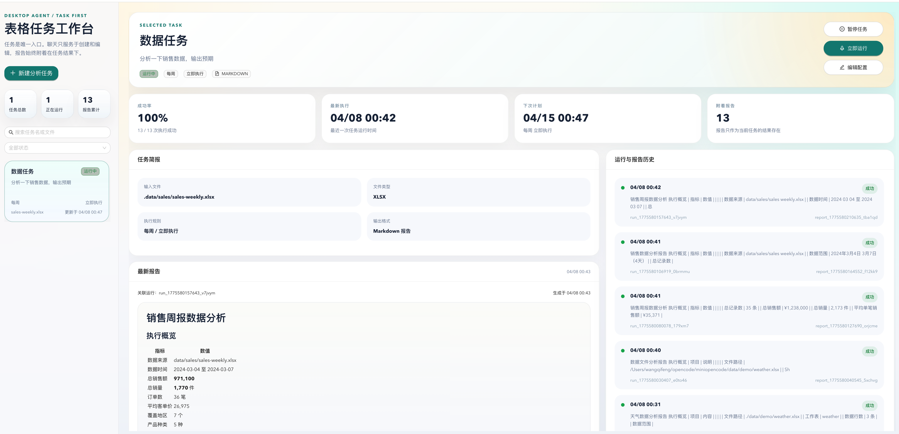

# 任务调度平台

基于 Vite + React + Ant Design 的任务调度管理平台。

## 当前页面



## 功能特性

- **任务工作台** - 围绕单个任务完成创建、编辑、启停和立即运行
- **草稿解析** - 通过自然语言调用 `/api/tasks/draft/resolve` 生成结构化任务草稿
- **文件上传** - 在创建任务弹层里直接上传 `CSV / XLSX` 到任务工作目录
- **实时任务状态** - 查看任务执行状态、历史运行和 Markdown 报告

## 技术栈

- **框架**: Vite + React 18
- **UI 组件**: Ant Design 5.x
- **语言**: TypeScript
- **样式**: LESS

## 快速开始

```bash
# 克隆项目后进入目录
cd task-scheduler-vite

# 安装依赖
npm install

# 启动开发服务器
npm run dev

# 构建生产版本
npm run build
```

访问 http://localhost:5173

## 项目结构

```
src/
├── main.tsx                 # React 入口
├── App.tsx                  # 根组件
├── mock/                    # Mock 数据
│   └── index.ts             # Mock 服务（劫持 fetch）
├── pages/
│   └── dashboard/           # 首页
│       ├── index.tsx       # 首页入口
│       ├── index.less       # 样式
│       └── components/      # 首页组件
│           ├── ToolsPanel.tsx   # 工具维护
│           ├── TasksPanel.tsx    # 任务管理
│           └── ChatPanel.tsx     # AI 聊天
└── services/
    ├── api.ts              # API 请求
    └── types.ts            # 类型定义
```

## 首页布局

```
┌─────────────────────────────────────────────────────────┐
│                    任务调度平台                           │
├───────────────────────────────┬─────────────────────────┤
│  工具维护                     │                         │
│  [卡片网格布局]                │     AI 助手              │
├───────────────────────────────┤     [聊天窗口]           │
│  任务列表                     │                         │
│  [卡片列表布局]                │     [设置按钮]           │
└───────────────────────────────┴─────────────────────────┘
```

## API 接口

| 模块 | 路径 | 说明 |
|------|------|------|
| 工具管理 | /api/tools | CRUD 操作 |
| 任务管理 | /api/tasks | CRUD + 启停控制 + 手动运行 |
| 任务草稿解析 | /api/tasks/draft/resolve | 把自然语言转换成结构化任务字段 |
| 任务文件上传 | /api/tasks/:id/files | 上传 CSV / XLSX 到任务工作目录 |
| 运行记录 | /api/runs | 查询任务运行结果 |
| 报告管理 | /api/reports | 查询 Markdown 报告 |
| 知识库 | /api/knowledge | CRUD 操作 |
| 流式聊天 | /api/web/chat/stream | 保留的任务编辑流式对话接口 |

详细接口集合见仓库根目录 `postman_collection.json`

## 开发指南

### 添加新页面

1. 在 `src/pages/` 下创建页面目录
2. 创建 `index.tsx` 和对应样式文件
3. 在 `App.tsx` 中引入

### 添加新 API

在 `src/services/api.ts` 中补充前端请求封装，并在服务端同步添加对应接口：

```typescript
export const yourAPI = {
  getList: () => fetchJSON('/your-endpoint'),
};
```

### 添加新组件

1. 在 `src/pages/your-page/components/` 下创建
2. 使用 antd 基础组件
3. 样式使用 LESS

## 数据联调说明

当前开发模式通过 Vite 代理访问本地后端：

- 前端请求 `/api/*`
- `vite.config.ts` 会代理到 `http://localhost:3000`
- 新建 / 编辑任务优先使用 `/api/tasks/draft/resolve`
- 上传文件使用 `/api/tasks/:id/files`
- 任务运行会由后端调用 agent 并生成 Markdown 报告

## 当前新建任务流程

1. 打开“新建分析任务”弹层后，前端先生成一个临时 `taskId`
2. 上传按钮位于聊天输入框右侧；上传时文件会直接写入该任务工作目录，并回填 `inputFilePath`
3. 左侧自然语言输入会调用 `/api/tasks/draft/resolve` 更新右侧草稿
4. 当前 UI 只支持 `manual`
5. 保存前会再次调用草稿解析接口，把最终 `analysisGoal` 抽象为具体分析目标文本
6. 保存时会提交 `uploadedFiles` 和 `workspaceDir`

## 后续开发

基于 `AGENTS.md` 文档继续开发：

1. 根据需要补充更多任务执行工具
2. 增加调度器与自动运行能力
3. 添加用户认证与权限管理
4. 考虑客户端封装（Tauri / Electron）

## 参考文档

- [Ant Design](https://ant.design/)
- [React](https://react.dev/)
- [Vite](https://vitejs.dev/)

## License

MIT
